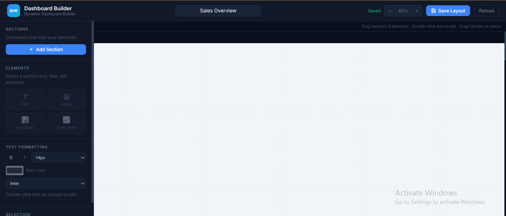

# Dynamic Dashboard Builder

A dynamic dashboard builder built using React, PHP, and MySQL that allows users to create customizable dashboards through an intuitive drag-and-drop interface.
Users can create sections, add widgets such as text, images, bar charts, and line charts, customize their layout, and persist the dashboard configuration in a MySQL database.
This project demonstrates frontend component architecture, API integration, file uploads, chart visualization, state management, and database persistence.

---

## Features

### Dashboard Sections
- Create sections dynamically
- Rename sections
- Drag and reposition sections
- Resize sections
- Delete sections

### Widgets
- Text Widget
- Image Widget
- Bar Chart Widget
- Line Chart Widget

### Text Editing
- Inline text editing
- Font size customization
- Font family selection
- Bold formatting
- Italic formatting
- Text color customization

### Image Management
- Upload images from local system
- Store images on the server
- Persist image references in database
- Display uploaded images inside dashboard sections

### Chart Management
- Add Bar Charts
- Add Line Charts
- Edit chart titles
- Edit labels and datasets
- Update chart values dynamically

### Dashboard Persistence
- Save dashboard layout
- Load saved dashboard layout
- Store section positions and dimensions
- Store widget configuration and content

### User Experience
- Drag-and-drop interface
- Resizable sections and widgets
- Zoom controls
- Responsive dashboard workspace

---

## Tech Stack

### Frontend
- React 18
- Vite
- Chart.js
- React ChartJS 2
- CSS

### Backend
- PHP 8+
- REST-style APIs

### Database
- MySQL 8+

---

## Project Structure

```text
project-root/
│
├── frontend/
│   │
│   ├── App.jsx
│   ├── App.css
│   ├── index.css
│   ├── main.jsx
│   │
│   ├── components/
│   │   ├── Sidebar.jsx
│   │   ├── Canvas.jsx
│   │   ├── Section.jsx
│   │   ├── ElementRenderer.jsx
│   │   ├── ChartEditModal.jsx
│   │   ├── BarChartWidget.jsx
│   │   └── LineChartWidget.jsx
│   │
│   └── lib/
│       └── api.js
│
├── backend/
│   │
│   ├── .htaccess
│   ├── router.php
│   │
│   ├── api/
│   │   ├── config.php
│   │   ├── dashboard.php
│   │   └── upload.php
│   │
│   ├── database/
│   │   └── schema.sql
│   │
│   └── uploads/
│
└── README.md
```

---

```

### Application Flow

1. User creates sections and widgets from the dashboard builder.
2. React manages the dashboard state.
3. Dashboard data is serialized into JSON.
4. PHP APIs validate and process requests.
5. MySQL stores dashboard structure and widget configuration.
6. Saved dashboards are reconstructed when loaded.

---

## Database Setup

Import the provided schema:

```text
backend/database/schema.sql
```

You can use:

- phpMyAdmin
- MySQL Workbench
- MySQL CLI

---

## Backend Setup

### Prerequisites

- PHP 8+
- MySQL 8+
- Apache (XAMPP / WAMP / LAMP)

### Configure Database

Update database credentials inside:

```text
backend/api/config.php
```

Example:

```php
'db' => [
    'host' => '127.0.0.1',
    'port' => 3306,
    'name' => 'dashboard_builder',
    'user' => 'your_username',
    'pass' => 'your_password',
]
```

### Start Backend

Start Apache and MySQL.

Ensure the uploads directory exists:

```text
backend/uploads/
```

---

## Frontend Setup

### Install Dependencies

```bash
cd frontend
npm install
```

### Create Environment File

Create a `.env` file inside the frontend directory:

```env
VITE_API_BASE=http://localhost/backend
```

Update the URL according to your backend configuration.

### Run Development Server

```bash
npm run dev
```

Application will be available at:

```text
http://localhost:5173
```

---

## API Endpoints

### Load Dashboard

```http
GET /api/dashboard.php?id=1
```

Returns dashboard data including sections and widgets.

### Save Dashboard

```http
POST /api/dashboard.php
```

Saves dashboard layout and widget configuration.

### Upload Image

```http
POST /api/upload.php
```

Uploads images and stores metadata.

---

## Sample Workflow

1. Create a section.
2. Rename the section.
3. Add text, image, or chart widgets.
4. Drag and resize elements.
5. Upload images.
6. Edit chart data.
7. Save the dashboard.
8. Reload and restore the saved layout.

---

## Screenshots

Add screenshots before submission.

### Basic Dashboard builder you can customized the builder based on your needs also with autosubmit option where you can add new section , you can add elements Also cutomized the font and save the layout features.



### You can customized your layout with texts where you can edit the text,resize the text and also customized it with various options from text formatting in sidebar.


### You can customized your layout with charts like Bar and line. You can also adjust the size of the charts and adjust the position. 


### You can also upload images and resize the image according to the need. 


---


## Deliverables

- Working Dashboard Builder Prototype
- SQL Schema with Sample Data
- REST API Backend
- Image Upload Support
- Complete Setup Documentation

---

## Author

Developed as part of a Dynamic Dashboard Builder assignment using React, PHP, and MySQL.